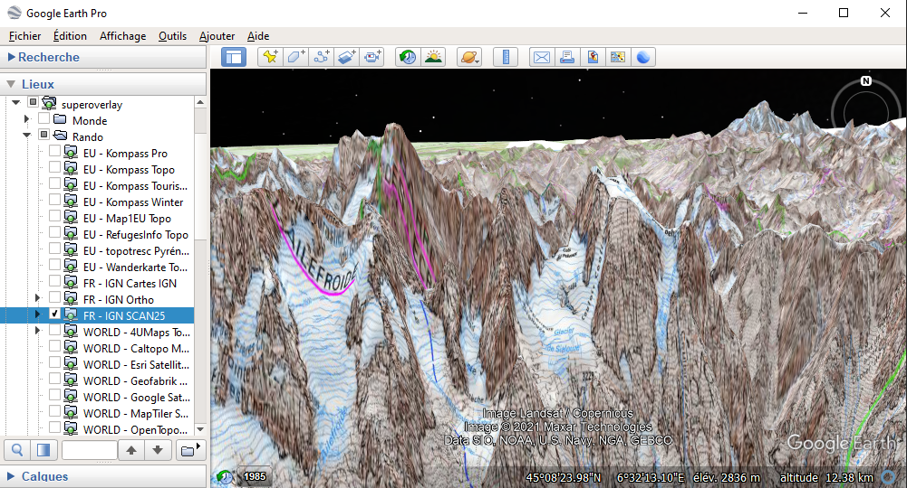
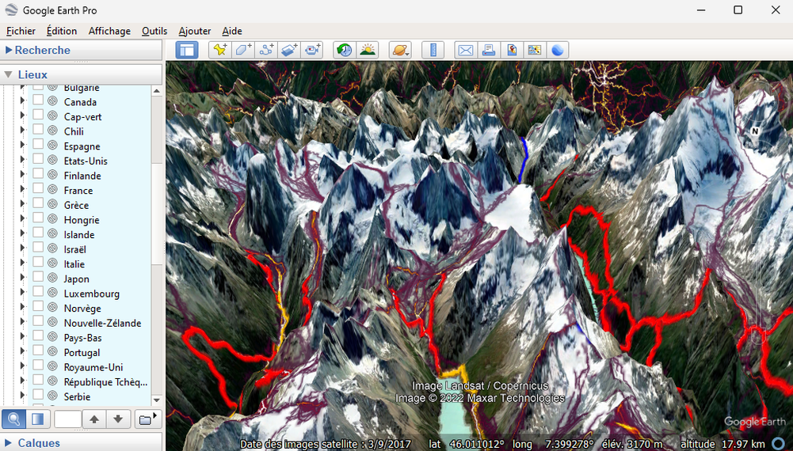
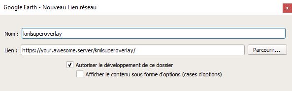

## A PHP gateway for displaying online map in Google Earth    

> **[Google Earth](https://www.google.com/intl/fr/earth/versions/)** is a super tool to discover earth but it only offers satellite imagery.   
> Online mapsources are consistent and mainly used in webpages, desktop clients and mobile apps so, why not in Google Earth?  
> **KmlSuperOverlay** is a simple PHP gateway that intends to meet this need :) Of course, it's not the unique one!  
>
> I used **[geos](https://github.com/grst/geos)** for a long time - An excellent all-in-one standalone tool but as I'm not a :snake: developer, I was not able to geek on it :(  
> Some "heavy" or complex **WSGI server** can also do that and some map providers, like [caltopo](https://training.caltopo.com/all_users/import-export/earth#super), do it for a fee. 
>
> *See [credits](#credits) below for further informations.*  

  
*French IGN topo over **Écrins***  
  
*Swiss hiking paths & Strava run heatmap over **Arolla***

### What kind of mapsources can I request?  

You can use every online map server that doesn't require specific referer or a 2 steps authentication - only url tokens is now supported.  
As you might know, there is no unique standard to request online tiles with some great complexity like the notorious EPSG!  

**KmlSuperOverlay** support:  

- **Tiled Web Map (TMS / WMTS)**  
  - Slippy Map (Standard)s  
  - Reverse Y  
  - Quad Tree  
- **Web Map Service (WMS)**   
  - Version 1.0.0 to 1.3.0, from what I know...  
  - EPSG 4326  
  - EPSG 3857 and some alias - *currently not exhaustively implemented*  
  - For other projections, I'm working on a transformation engine with [cs2cs](https://proj.org/apps/cs2cs.html) from [proj](https://proj.org) with good results on coordinates transformation but still have issues with re-projection...  
### What are the benefits & features of this *wonderful* Gateway?  

- Pure & simple PHP. No dependencies or composer modules.  
- Fast or low memory footprint - *That's why I concatenate string rather than using simple_xml. Thanks not yelling at me ;)*  
- Based on [Mobile Atlas Creator (mobac)](https://mobac.sourceforge.io/) and [GEOS](https://github.com/grst/geos) mapsource xml files.  
### Pre-requisites  

- #### PHP >= 8 (_see [#1](https://github.com/nono303/kmlsuperoverlay/issues/1) for PHP7_) 

  - [tidy](https://www.php.net/manual/fr/book.tidy.php) extension for a better kml formating  (_optional_)  
  - [zip](https://www.php.net/manual/fr/book.zip.php) extension for kmz support (_optional_)
- #### httpd 2.4  
  
  - Will works with 2.0 or 2.2 just changing `Require` term in configuration  
### So, how does it work? in fact, quite simply!  

> `/kmlsuperoverlay` will be the **"how-to" end-point** example  

#### 1.  httpd : add this to your host or vhost config:  

```  
LoadModule rewrite_module ./modules/mod_rewrite.so  
...  
<Location /kmlsuperoverlay >  
  RewriteEngine on  
  RewriteCond %{REQUEST_FILENAME} !/kmlsuperoverlay/index.php  
  RewriteRule ^(.*)$ /kmlsuperoverlay/index.php?qs=$1 [L,QSA]  
</Location>  
  
<Location /kmlsuperoverlay/mapsources >  
  Require all denied  
</Location>  
```

#### 2.  php : (optional) enable tidy & zip  in php.ini  

```  
extension=tidy  
extension=zip  
```

#### 3.  copy `/index.sample.php` to `/index.php` and configure it to fit your environment  

```  
// !! with ending '/'  
define("MAP_SOURCE_ROOT","./mapsources/");  
// !! with ending '/'  
define("URL_BASE","/kmlsuperoverlay/");  
```

#### 4. Use it in Google Earth : add > network link  

  

:boom:**it works!**:boom:  

#### 5. Tuning : `/class/KmlSuperOverlay.php`  

All the "fine" tuning might be done with the static vars of `KmlSuperOverlay` Class  

- `worldBbox`: Default bounding box coordinates for region overlayed  
- `tidyOptions` : Operation made by Tidy (if enabled) to prettify kml format  
- `kmlformat`: Header, footer and styles for the generated kml file  
- `lod`: [Level Of Detail](https://developers.google.com/kml/documentation/kmlreference#lod) configuration for groundOverlay (tiles) and networklink (kml)  
  - Values are automatically overridden in case of:  
    - `overlay == false OR current zoom value == mapsource maxZoom >> lod["groundOverlay"]["maxLodPixels"]` **disabled**  
    - `current zoom value == mapsource minZoom >> lod["groundOverlay"]["minLodPixels"] && lod["networkLink"]["minLodPixels"]` **disabled**   
    - Current values are optimized for 256x256px tile size.  
- `altitude`: Limit tile displaying between certain altitude point of view (0 = no limitation)  
- `minZoom`: Set the minimum displayed zoom even if mapsource minZoom is lower than defined  
- `displayRegion`: Enable or disable the display of a green rectangle representing the region if defined in mapsource.  
- `debugHtml`: if set to true, display **kml** output in **html** for browser rendering only  
- `outFormat`: `.kml` or `.kmz`. Default is `.kml`
  - **kmz** need **zip** extension to be enabled and offer less bandwidth but more cpu usage  
#### 6. Debug  

Just end url with **`/debug`**, it's will set debug mode for all kml networklink.  
Currently just dumping performance metrics on description element of the kml document.  
Debug output can be **html** or kml (_see above_). **kmz** is disabled, even if it's set as the default output format.  

You may have a look at [Google kml superoverlays reference page](https://developers.google.com/kml/documentation/kml_21tutorial#superoverlays) to interpret kml output  

#### 7. Add mapsources  
> :point_up: If you are a **mobac** and/or **geos** user, you can simply define `MAP_SOURCE_ROOTs` as same as their map sources directory
> **KmlSuperOverlay** will only keep xml **customMapSource** - _excluding `xml` customMultiLayerMapSource and `bsh` BeanShell Script_
> _see [#305 issue on mobac](https://sourceforge.net/p/mobac/feature-requests/305/) for extra elements_

I provided **as an example** few mapsources for each format and feature in `./mapsources`  
**Please have a look on map providers general conditions of use before** and see [Resources](#Resources) to enlarge your collection ;)  

- Full documentation about `customMapSource` is available on [geos website](https://geos.readthedocs.io/en/latest/users.html#more-maps)  

  - <backgroundColor> described on [mobac website](https://mobac.sourceforge.io/wiki/index.php/Custom_XML_Map_Sources#backgroundColor)  might be used to set **transparency** *(only last hex value is used)*

    - **transparent**: `#FFFFFF`**`00`** :warning: Tile will not be visible
    - **50% transparency**: `#FFFFFF`**`80`**

    - **opaque**: `#FFFFFF`**`FF`** *(default)*
- I added:  
  - <serverParts> described on [mobac website](https://mobac.sourceforge.io/wiki/index.php/Custom_XML_Map_Sources#serverParts)  
  - <overlay> not documented as it's actually specific:  
    Just add <overlay>`true`</overlay> for tiles in PNG Alpha (transparency)   
    it will change [Level Of Detail (lod)](https://developers.google.com/kml/documentation/regions#pixelrange) configuration to ensure that low zoomed tiles will not be visible and override the viewed ones
#### 8. :warning: ​Beware!  

- Be sure to encode your `customMapSource` xml files in **utf8**, otherwise they'll not appear in your list if it contains accented char `#frenchy`  
### Credits  

- **[@grst](https://github.com/grst)** for [geos](https://geos.readthedocs.io) - My main inspiration for this project.  
- **[@r_x](https://sourceforge.net/u/r_x/profile/)** for [mobac](https://sourceforge.net/p/mobac/) - A "must-have" tool for all _GeekHiker_ like me ;)  
- **@Nicolas.Paour** for [randochartreuse](http://randochartreuse.free.fr/) - The *"good maths"* for coordinates transformation.  
### Resources  

- **Other "SuperOverlay" tools**  
  - [geos](https://github.com/grst/geos)  
  - [MapServer](https://mapserver.org/id/input/vector/kml.html#example-3-displaying-a-superoverlay-kml-file)  
  - [GeoServer](https://docs.geoserver.org/latest/en/user/services/wms/googleearth/features/kmlsuperoverlays.html)  
  
- **Map Servers list**  
  - https://wiki.openstreetmap.org/wiki/Tile_servers  
  - https://josm.openstreetmap.de/wiki/Maps#Listofsources  
  - https://github.com/grst/mapsources  
  - https://en.wikipedia.org/wiki/List_of_online_map_services  
  - https://giswiki.hsr.ch/Hintergrundkarten  
  - http://randochartreuse.free.fr/mobac2.x/mapsources/  
  - https://dzjow.com/2012/04/12/free-online-topographic-maps-for-hiking/  
  - https://osmlab.github.io/editor-layer-index/  
  - https://www.randonner-leger.org/wiki/doku.php?id=cartographie_et_informations_pour_la_randonnee#cartes_glissantes_en_ligne  
  - https://github.com/Ecotrust/madrona/blob/master/madrona/layer_manager/utils/proc_layers.py  
  - https://projects.webvoss.de/2017/06/03/creating-the-perfect-hiking-map-for-germany-and-other-countries/  
  - http://www.f-bmpl.com/index.php/faites-le-vous-meme/210-3-listing-des-serveurs-ortos  
  - https://api.routeconverter.com/v1/mapservers/?format=xml  
  - https://www.camptocamp.org/articles/676486/fr/cartes-topographiques-en-ligne  
  - https://xyz.michelstuyts.be/  
  - http://www.vttour.fr/articles/read_35.html  
  - https://www.creazo.fr/listing-des-fonds-de-cartes-dopen-street-map/